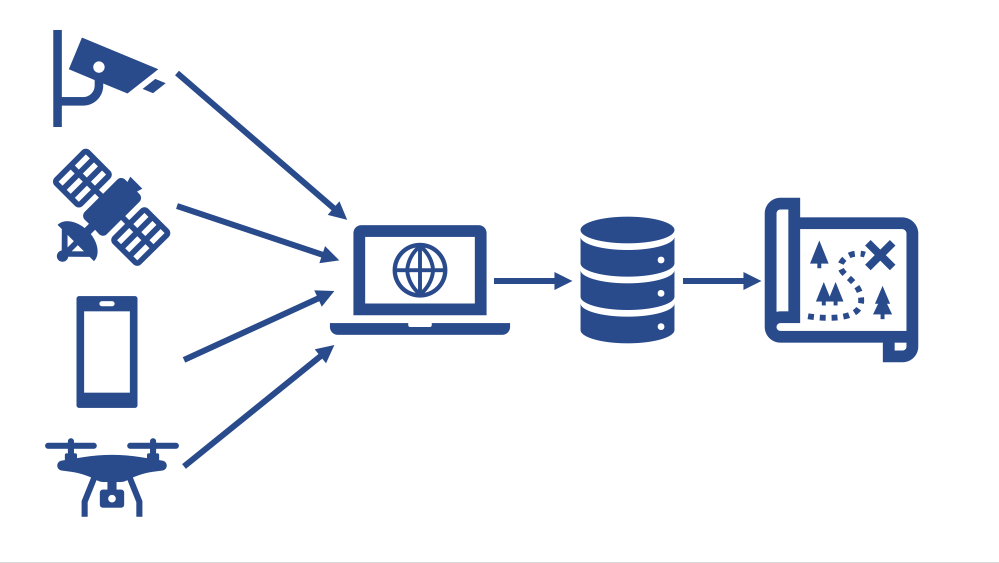

# HackPSU-Sauron
Entry for [HackPSU](https://hackpsu.org/) Spring 2022.

Minimal Viable Product of an AI powered disaster event data aggregator.  
Powered by OpenCV, Google Cloud Platform, and Flask.  

# 🏆 Awards 🏆 
- 🥇 Won HackPSU 1st Place prize!  
- 🥇 Won the Nittany AI Challenge 1st Place prize!  

# Team Members
- Tyler Sengia
- Normen Yu
- Ralph Quartiano
- Jared Armagonst
- Michael Da Rocha

Check out [the hackathon](https://hackpsu-spring-2022.devpost.com/) and [our submission](https://devpost.com/software/sauron-ke72by) on DevPost.

